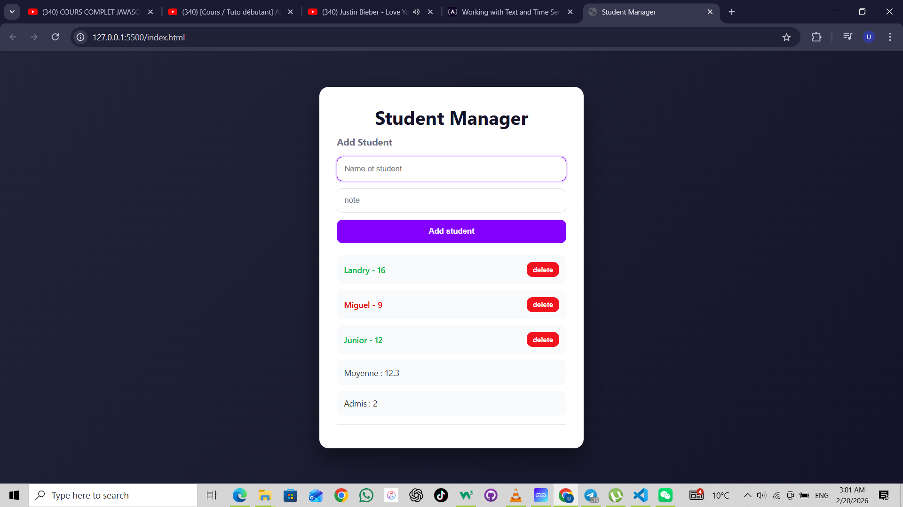

#  Student Manager App

A simple student management application built with HTML, CSS and JavaScript.

##  Features

- Add students dynamically
- Delete students
- Automatic average calculation
- Form validation
- Professional UI design

##  Technologies Used

- HTML
- CSS
- JavaScript (DOM manipulation)

##  What I Learned

- Working with arrays of objects
- Using forEach() and filter()
- DOM manipulation
- Event handling
- Dynamic rendering
- Basic UI/UX improvements

##  Screenshot

## 🌐 Live Demo

👉 https://tuldev25.github.io/student-manager-app/
Made as a practice project 
